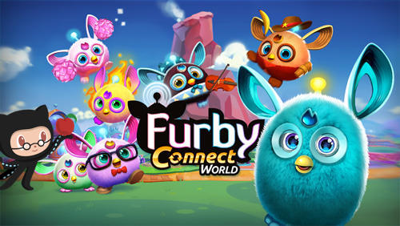

# Furby electron



This app is meant to communicate with a Furby connect. By default, this works great with https://github.com/tclem/atom-furby. Install the Atom plugin, and run this application and you'll see a small menubar application. As you work your Furby connect should pair with you.

### Wait, I don't have a furby!

Luckily you can still try it out: if no Furby is connected it uses the `say` command locally.

But you should really get a [Hasbro Furby Connect](https://www.amazon.com/gp/product/B01EARLU16/ref=as_li_tl?ie=UTF8&camp=1789&creative=9325&creativeASIN=B01EARLU16&linkCode=as2&tag=bigfuncoding-20&linkId=71f61074218432de05081fd12b27766c)!

> NOTE: Furbies need 4 AA batteries or you'll want to [hack in USB power](https://github.com/Jeija/bluefluff/issues/36)

## Developing

Clone the repo and run:

```
npm install
npm start
```

NOTE: Node 8 seems to work best for the bluetooth drivers (`brew install node@8` on macOS).

### That annoying warning while developing

```bash
sudo /usr/libexec/ApplicationFirewall/socketfilterfw --add $(pwd)/node_modules/electron/dist/Electron.app
```

# Thanks

Much of the code (fluffcon, fluffaction and some of the server patterns) come directly from https://github.com/Jeija/bluefluff
